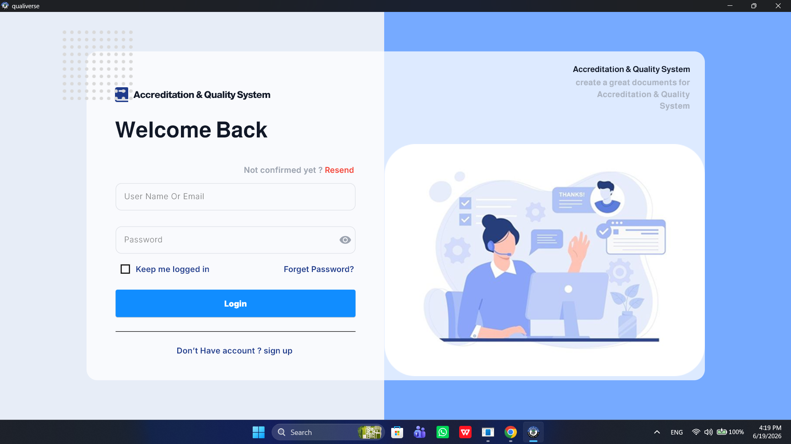
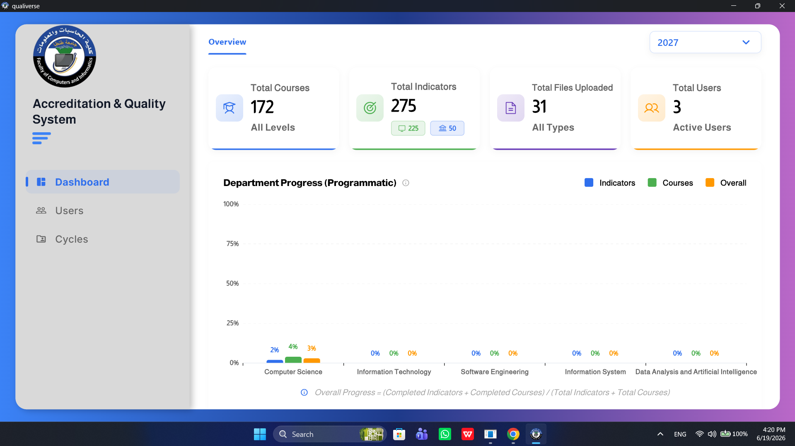
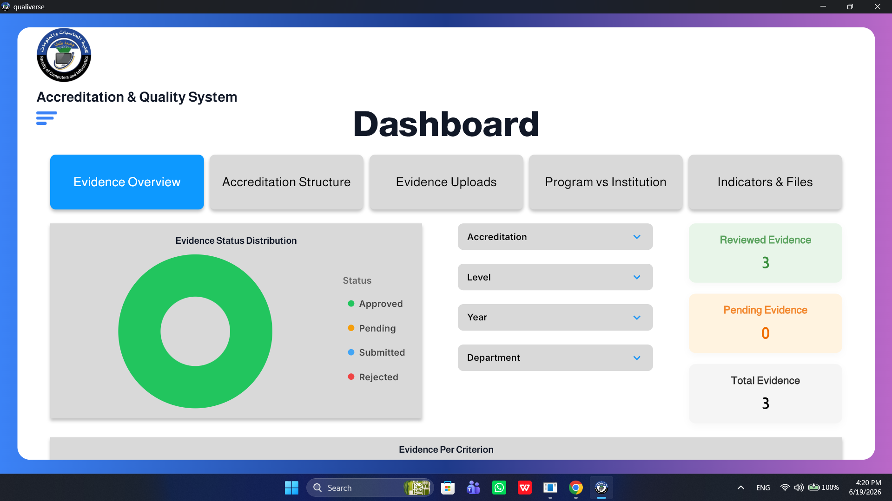
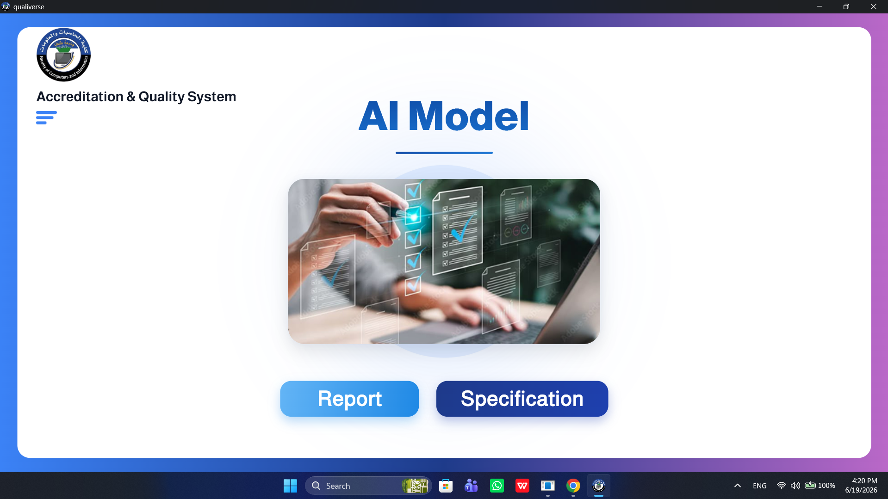
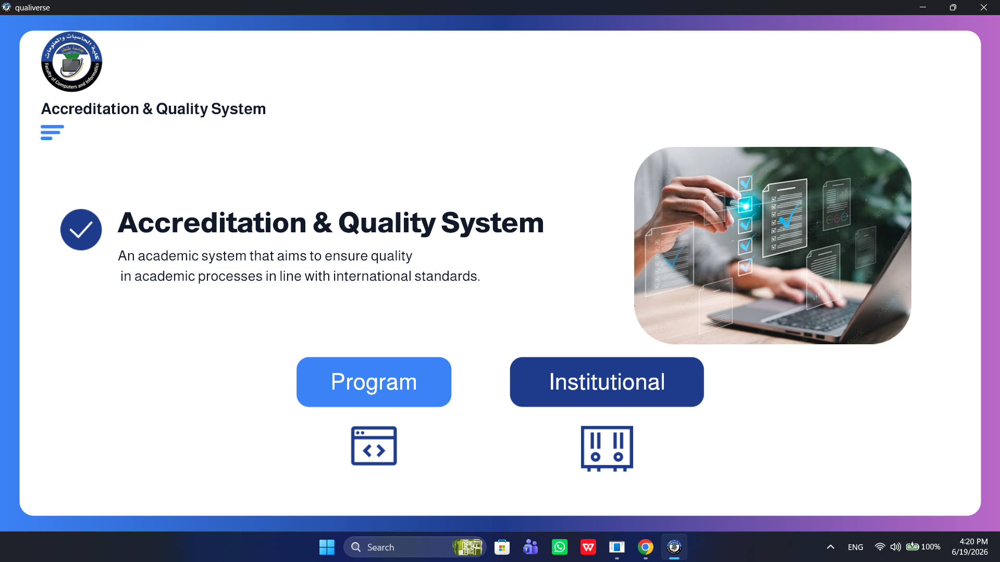
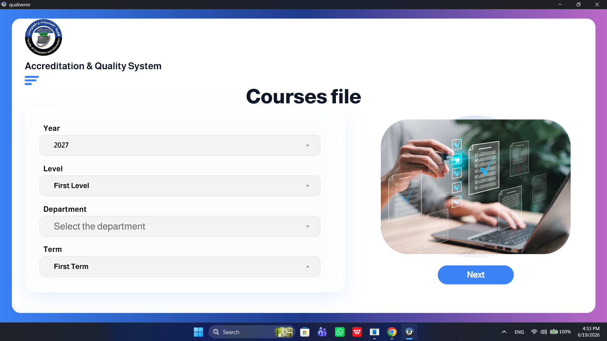
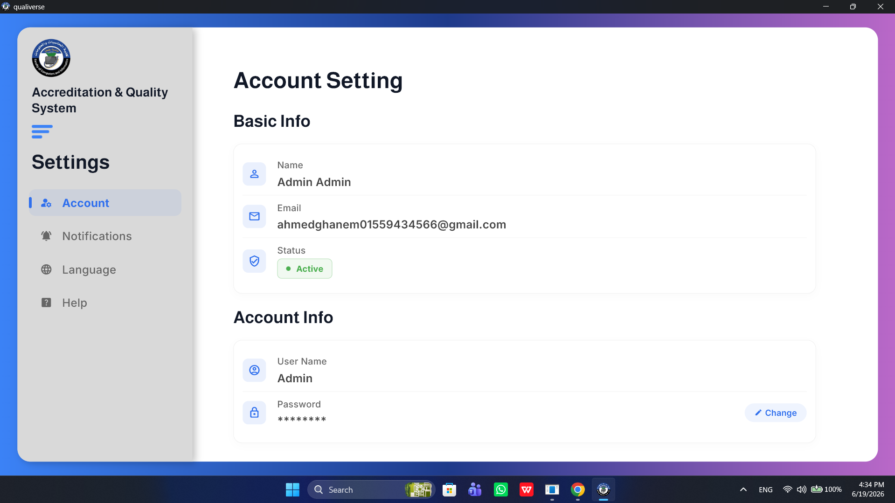

<div align="center">

  

  <h1>🌌 Qualiverse</h1>
  
  <p><b>An Advanced AI-Powered Accreditation & Quality Management System</b></p>
  <p><i>The Ultimate Graduation Project for Higher Education & Faculties of Computers and Informatics</i></p>

  <!-- Badges -->
  <p>
    <a href="https://flutter.dev"></a>
    <a href="https://dart.dev"></a>
    <a href="https://bloclibrary.dev"></a>
    <a href="https://blog.cleancoder.com/uncle-bob/2012/08/13/the-clean-architecture.html"></a>
    
  </p>

</div>

---

## 📖 About The Project

**Qualiverse** is an enterprise-grade desktop application designed to revolutionize how educational institutions manage their accreditation processes, quality assurance, and academic tracking.

Developed as a standout **Graduation Project**, Qualiverse eliminates manual paperwork by automating the generation of complex academic reports using **Artificial Intelligence**. It provides a centralized hub for tracking courses, managing evidence files, and monitoring the overall performance of faculty members.

---

## 🎯 The Vision

The goal of this project is to bridge the gap between traditional, paper-heavy academic quality management and modern, AI-driven solutions. It empowers colleges to:
- **Save Time:** Automate repetitive reporting tasks.
- **Ensure Accuracy:** Reduce human error in accreditation evidence collection.
- **Enhance Visibility:** Provide Admins and Quality Assurance staff with real-time insights into institutional progress.

---

## ✨ Key Features

| Feature | Description |
|---------|-------------|
| 🤖 **AI Report Generation** | Automatically generate comprehensive Course Descriptions, AI Reports, and Quality Files. Export directly to **PDF** or **DOCX** with a single click. |
| 🔐 **Role-Based Access (RBAC)**| Secure, customized interfaces tailored for **Admins**, **Doctors**, and **Quality Assurance Users**. |
| 📂 **Smart Evidence Management**| Upload, download, and organize accreditation files (Excel, Word, PDF, Images) into structured Evidence Folders with real-time tracking. |
| 📊 **Interactive Dashboards** | Visualize real-time metrics, academic cycles, and compliance indicators using advanced charting libraries. |
| 👨‍🏫 **Task & Course Assignment**| Admins can assign specific academic courses and quality indicators to faculty members, complete with deadlines. |
| 🌍 **Full Localization (i18n)** | Native support for both **English (LTR)** and **Arabic (RTL)**, allowing users to switch languages instantly. |
| 🎨 **Premium UI/UX** | Pixel-perfect, modern layouts optimized seamlessly for Desktop environments using dynamic screen utilities and smooth micro-animations. |

---

## 💻 App Previews & Screenshots

<p align="center">
  
  
  <br><br>
  
  
  <br><br>
  
  
  <br><br>
  
</p>

---

## 🛠️ Technology Stack & Architecture

This project was built following industry best practices, emphasizing scalability, maintainability, and clean code principles.

### **Core Stack**
- **Framework:** Flutter (Desktop)
- **Language:** Dart
- **State Management:** `flutter_bloc` (Strict separation of Business Logic from UI)
- **Routing:** `go_router` (Advanced declarative routing)

### **Architecture: Feature-Driven Clean Architecture**
The application enforces strict boundaries between layers:
- **Presentation:** UI, Widgets, and BLoC/Cubit for state management.
- **Domain:** Business logic, Entities, and abstract Repository definitions.
- **Data:** API Clients, Dio Interceptors, and Local Storage implementation.

### **Advanced Integrations**
- **Networking:** Custom `dio` interceptors for seamless JWT Token Refresh and robust error handling.
- **Storage:** Secure local storage for caching sessions and application state.

---

## 🚀 Getting Started

To run this application locally on your Windows machine:

1. **Clone the repository:**
   ```bash
   git clone https://github.com/yourusername/qualiverse.git
   cd qualiverse
   ```

2. **Install dependencies:**
   ```bash
   flutter pub get
   ```

3. **Run the app (Windows Desktop):**
   ```bash
   flutter run -d windows
   ```

---

## 🎓 Graduation Project Excellence

If you are a recruiter or an academic evaluator reviewing this repository, here is why **Qualiverse** stands out:
- **Proactive Security:** Implemented advanced Proactive Token Refresh logic to renew authentication seamlessly before expiration.
- **Complex State Management:** Successfully handled complex asynchronous operations, multipart file uploads, and real-time UI updates without memory leaks.
- **Scalable Foundation:** The folder structure and architecture are designed to scale to hundreds of screens and developers.
- **Production Ready:** Includes robust error handling, loading states, localization, and a highly responsive design methodology.

---

<div align="center">
  <i>Designed and developed with ❤️ for the future of Higher Education.</i>
</div>
